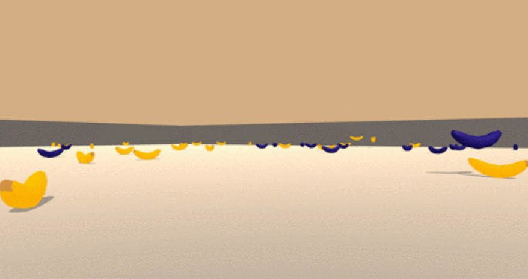

# banana_navigation

### Description

This repository shows how a deep neural network can be trained to control an agent in some environment. In this case the environment is quadratic world full of yellow and blue bananas. See the image below:

The task is to control the agent and pick up as many yellow bananas as possible within a certain timeframe (the task is episodic). This behavior can be enforced by the reward fed back by the environment. In particular picking up a blue bananda yields -1 while picking up a yellow one yields +1. Moreover, the agent can be controlled by the four basic actions 'move forward', 'move backward', 'turn left' and 'turn right'.

### Setup 

The environment is provided by Unity. To setup this project follow the instructions given here: https://github.com/udacity/deep-reinforcement-learning

### Structure 

This project contains three main files: 

- `agent.py` which defines the DQN-agent interacting with the environment
- `model.py` that contains the definition of the underlying neural network of the agent
- `replay_buffer.py` that contains the class for the replay buffer (which is also part of the agent)

To train the model simply exeute the cells in `train.ipynb`. This will train a new agent and save the model along with a plot of the training history in the folder called `model`. To test the trained agent run the cells in `test.ipynb`.

### Training Scheme

Training the agent (initilaized with its default parameters defined in `agent.py`) for 2000 episodes yields the following training history:

After 750 episodes the rolling average score over 100 episodes is clearly above the critical value of 13. During training the agent's Q-network was retrained every 4 timesteps. A epsilon-greedy policy was used with a constant epsilon of 0.01. See `train.ipynb` for more details.

### Further Details (Report)

For further details about the used algorithm itself please take a look at this report: https://www.notion.so/Report-Project-1-41e6027a45bc487db06fcfb3603b8a3c
