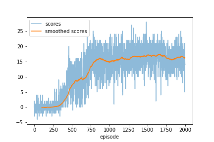

# banana_navigation

### Setup 

To setup this project follow the instructions given here: https://github.com/udacity/deep-reinforcement-learning

### Sturcture 

This project contains three main files: 

- `agent.py` which defines the DQN-agent interacting with the environment.
- `model.py` that contains the definition of the underlying neural network of the agent
- `replay_buffer.py` that contains the class for the replay buffer (which is also part of the agent)

Moreover, to train the model simply exeute the cells in `train.ipynb`. This will train a new agent and saves the model along with a plot of the training history in the folder called model. To test your trained agent run the cells in `test.ipynb`.

### Training Scheme

Training the agent (initilaized with its default parameters defined in `agent.py`) for 2000 episodes yields the following training history:

After 750 episodes the rolling average score over 100 episodes is clearly above the critical value of 13. During training the agent's Q-network was retrained every 4 timesteps. A epsilon-greedy policy was used with a constant epsilon of 0.01. See `train.ipynb` for more details.
